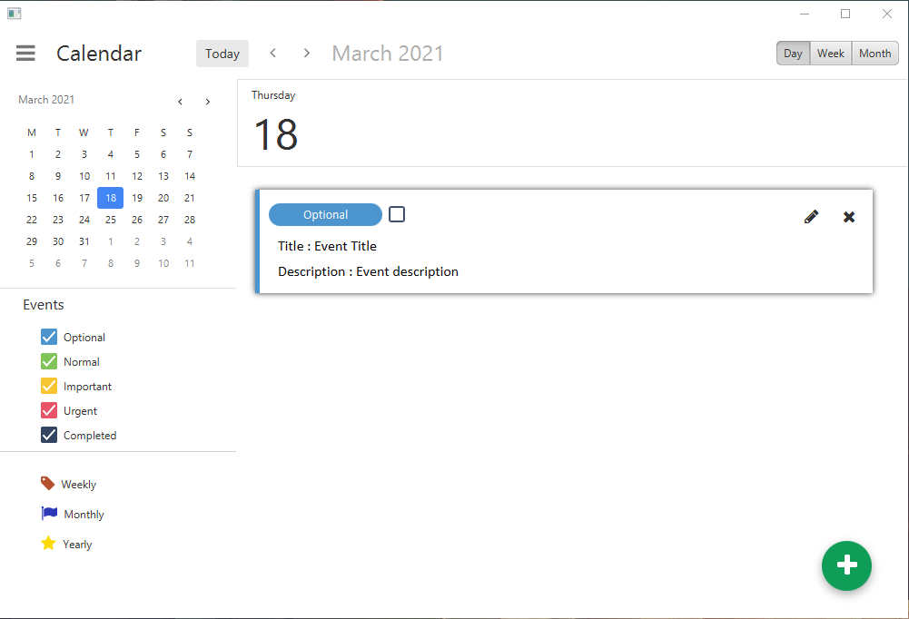
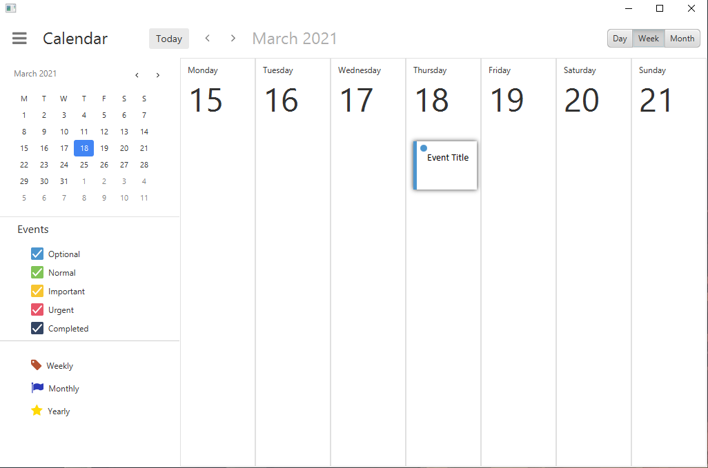
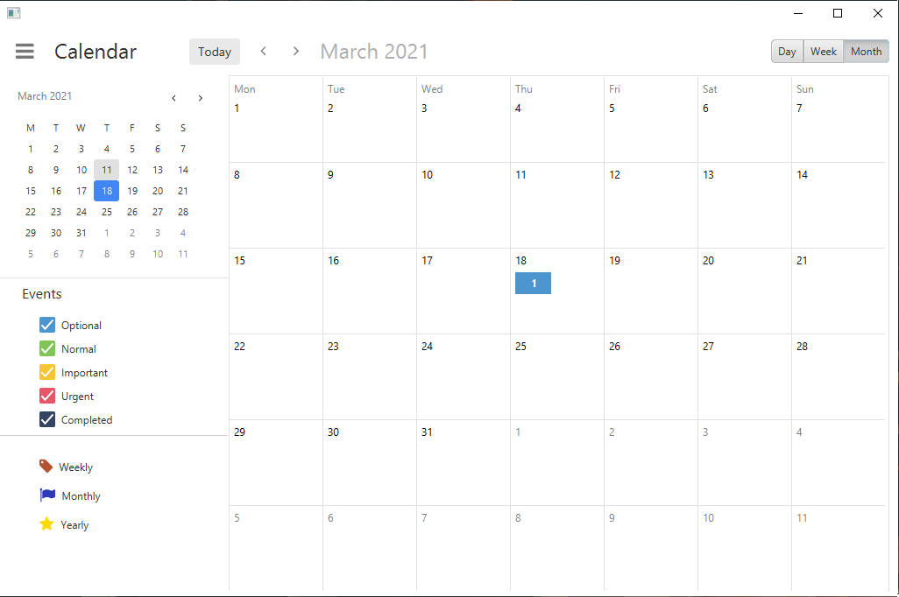

# JFXCalendar

This library contains a simple calendar view and an event manager to store and display events. The feel and look of the user interface were inspired by Google Calendar. It is really easy to use and can be integrated into any JavaFX application. 

DayView   |  WeekView | MonthView
:-------------------------:|:-------------------------:|:-------------------------:
  |   | 


#### How to use it?
1. Create the event manager which contains and handles the events 
2. Create the JFXCalendarView and add it to your Pane

```java
// Event manager which contains all the events 
CalendarEventManager eventManager = new CalendarEventManager();

// Calendar view
JFXCalendar calendar = new JFXCalendar(eventManager);
```

#### How to add an event

There are two type of events <b>ONE_TIME_EVENT</b> and <b>RECURRING_EVENT</b>. Each event has a priority {OPTIONAL, STANDARD, IMPORTANT, URGENT| each has a different color.


```java
// EXAMPLES 
// ===========================
event = new CalendarEvent(title, eventType, description);
event.setType(CalendarEvent.ONE_TIME_EVENT);
event.setDate(LocalDate.now());

// per week
event = new CalendarEvent(title, eventType, description);
event.setType(CalendarEvent.RECURRING_EVENT);
event.setPeriodicType(CalendarEvent.PER_WEEK);
event.setDaysInWeek("1,3,5,7"); // monday, Wednesday , Friday , Sunday

// per month
event = new CalendarEvent(title, eventType, description);
event.setType(CalendarEvent.RECURRING_EVENT);
event.setPeriodicType(CalendarEvent.PER_MONTH);
event.setPlaceInMonth(CalendarEvent.START_OF_MONTH);
// or event.setPlaceInMonth(CalendarEvent.END_OF_MONTH);

// per year
event = new CalendarEvent(title, eventType, description);
event.setType(CalendarEvent.RECURRING_EVENT);
event.setPeriodicType(CalendarEvent.PER_YEAR);
event.setYearlyDate(LocalDate.now());

// refresh the calendar
calendar.refreshCalendar();
```

JFXCalendar allows the user to interact with the events. The user can edit an event ( priority or date ), mark it as completed, or delete it. Of course, the user can add new entries using the UI like :


#### External Libraries
JFXCalendar is using :
* ControlsFX : version 8.40.14
* JFoenix : 8.0.10
* FontAwesomeIcons : 8.9 

I have tested the code with Java 1.8. This project is kinda old and I haven't tested it with the newest versions for the above.
